# JasonSandeman_T2A2 - PayProof

This is a 2-sided marketplace application called PayProof that i built for my Term 2 Ruby on Rails Assignment.

## 🔗 Links

- [Live Demo](https://payproof.herokuapp.com/)
- [Github Repo](https://github.com/jwsandeman/PayProof)

## The Problem

When it comes to domestic renovations, upgrades, extensions, repairs and service work there is a common gripe amongst tradies and that is customers who don’t pay on time. This is a huge problem in the domestic trade industry as time and time again tradies are contracted to complete work on a customer's residence only to have the customer take months to pay the invoice or in some cases not pay at all.

Not having regular income is a massive cash-flow bottleneck and can really affect how a business is run, causing a lot of frustration and lost time when a tradie continuously has to chase down customers that aren't paying their bills. This often leads to frustration and resentment towards customers which can bleed into new jobs with customers they have never worked with before.

## The Solution

PayProof aims to solve this problem by connecting tradies to customers with a pre-approved job payment guarantee that takes place before any work has begun. Once a tradie and customer agree on a set price for the job, the customer can then verify through the app that they have the required funds. This will give the tradie peace of mind that the customer actually has the money before they begin working on the job.

Once the job has been completed successfully (according to the conditions set by both parties), then the customer can release the funds to the tradie. This opens a direct line of communication between the tradie and the customer with a job status dashboard where they can track the job stages as it progresses. This also allows for issues and problems to be sorted out before moving on to the next stage of the job.

## App Overview

### Purpose

The purpose of this app is to provide customer proof of funds to a tradie before a job commences. The high-level features of this app will be a home page, profile page and job page.
There will be two types of users in this app, homeowners and tradies which will be decided based on what a user selects when they sign up.

Depending on their user status they will have access to different parts of the app. For example, a tradie will be able to submit quotes to an open job however a homeowner will not be able to. Both homeowners and tradies will be able to view completed jobs and their reviews. These reviews will also be displayed on the relevant user's public profile page so that other users can see what they are like to work with.

### Features

**Guests:**

- Home page displayed in a single column blog format similar to twitter/realestate.com
  - Recently completed jobs showcasing tradies works
  - Open jobs looking for quotes
  - Homeowner reviews
  - Tradie Reviews
- Log in/sign up/forgot password page
- Navbar to navigate around the application

**Homeowner:**

- Profile page
  - edit profile button
  - bio/interests
  - PayProof score (number of jobs that were successfully completed versus the number of jobs that were paid on time).
  - user rating (positive feedback rating)
  - direct message button (future implementation)
  - showcase reviews in a ‘scrolling feed’ format
- Job creation page
- Job edit page
  - Job details can’t be edited once the job has begun unless both parties agree to the changes (variation - future implementation)
- Jobs page displayed in a single column blog format similar to twitter/realestate.com
  - Homeowner's active jobs will be displayed at the top of the page
  - Homeowner’s closed Jobs will be displayed below active jobs
- Job page to provide an overview of an active job
  - notifications/messages/actions needed to be taken(future implementation)
  - capture payment proof once quote is submitted and approved
  - release funds once the job is complete and the homeowner is happy

**Tradie:**

- Profile page
  - edit profile button
  - bio/specialty
  - PayProof score (jobs completed versus jobs successfully completed)
  - User rating (positive feedback rating)
  - direct message button(future implementation)
  - project showcase
  - showcase reviews in a ‘scrolling feed’ format
- Job creation page
- Job edit page
  - Job details can’t be edited once the job has begun unless both parties agree to the changes (variation -future implementation)
- Jobs page displayed in a single column blog format similar to twitter/realestate.com
  - Tradies’ active jobs will be displayed at the top of the page
  - Tradies’ closed Jobs will be displayed below active jobs
- Job page to provide an overview of an active job
  - notifications/messages/actions needed to be taken(future implementation)
  - submit a quote to the homeowner for approval
  - submit the completed job with photos to the homeowner for approval and release of funds

### Sitemap

Here is a [link](https://whimsical.com/payproof-sitemap-5AEDLwnz5iPdHTTGB5yJ9H) to my sitemap.

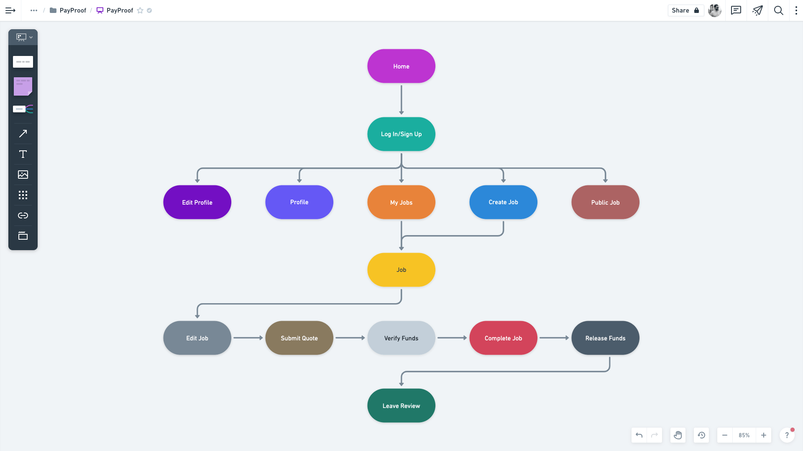

### Target Audience

The target audience for this app is Tradies and Homeowners. Tradies that are looking to save time and effort in chasing up overdue payments from homeowners will benefit the most from this app. Homeowners that are looking for local tradesmen that have proven track records of completing jobs on time and to a high standard of quality will also benefit from this app.

### Tech Stack

**Front End:**

- Programming Language - Ruby, HTML, ERB
- Full-stack Framework - Ruby on Rails
- Styling Framework - Sass/Bootstrap
- Form Submissions - Simple Form

**Back-End:**

- Database Management - Postgresql
- Deployment & Hosting Infrastructure - Heroku

**3rd-Party Services:**

- Cloud Storage - Amazon S3
- Authentication/Authorisation - Ruby Gem(Devise)
- Payment Integration - Stripe(future implementation)
- Project Management - Notion
- Flowcharts - Whimsical
- Source Control - Github
- Database Schema Drawing - DrawSQL

## User Stories

### Guest Epic

- As a guest i want to be able to navigate around the various sections of the website
- As a guest, I want to be able to log in or sign up so that I can post job listings.
- As a guest, I want to be able to reset my password so that I can log in.
- As a guest, I want to be able to browse the job board so that I can find a local trustworthy tradie.
  - As a guest, I want to be able to see recently completed jobs by tradies so I can view photos of their work.
  - As a guest, I want to be able to see homeowners’ reviews of the tradie’s job so that I can get a feel for the tradie’s personality and work ethic.
  - As a guest, I want to be able to view the tradie’s review of the job so that I can get a more rounded opinion of how the job went.
  - As a guest i want to be able to view open jobs that are looking for quotes

### Homeowner Epic

- As a homeowner, I want a profile page so that tradies can see my ratings, and reviews.
- As a homeowner, I want to edit my profile so that I can update my details.
- As a homeowner, I want a direct message button so a tradie can contact me once we are already connected (future implementation).
- As a homeowner, I want to be able to create a job listing so that I can find a tradie.
- As a homeowner, I want to be able to create a job listing so that I can get quotes from eligible tradies.
- As a homeowner, I want to be able to approve a quote from a tradie so that I can start the job with them(future implementation).
- As a homeowner, I want to be able to edit specific details of a job so that the job is kept up to date.
- As a homeowner, I want to be able to edit a job and submit it to the tradie for approval(future implementation).
- As a homeowner, I want to be able to view my jobs so that I can see all of my active, open and closed jobs.
- As a homeowner, I want to view the job page so I can see the job status and photos to see how the job is progressing.
- As a homeowner, I want to be able to submit comments and photos for the tradie to read(future implementation).
- As a homeowner, I want to be able to see my notifications/messages/actions so that I know what needs to be done(future implementation).
- As a homeowner, I want to be able to submit my payment details for payment proof-verification so that the builder can start working.
- As a homeowner, I want to be able to release the funds to the builder once I am happy with the job so that the builder gets paid.
- As a homeowner, I want to be able to log out so that I can close my session.

### Tradie Epic

- As a tradie I want a profile page so that homeowners can see my ratings, jobs, specialties and reviews.
- As a tradie I want to edit my profile so that I can update my details.
- As a tradie, I want a direct message button so that a homeowner can contact me(future implementation).
- As a tradie I want to be able to create a job listing so that I can invite a customer to the job(future implementation).
- As a tradie, I want to be able to edit a job and submit it to the homeowner for approval(future implementation).
- As a tradie, I want to be able to view my jobs so that I can see all of my active, open and closed jobs.
- As a tradie, I want to view the job page so I can see the job status and photos to see how the job is progressing.
- As a tradie, I want to be able to submit comments and photos for the homeowner to read(future implementation).
- As a tradie, I want to be able to see my notifications/messages/actions so that I know what needs to be done(future implementation).
- As a tradie, I want to be able to submit a quote to the homeowner so that they can approve it and I can start working.
- As a tradie, I want to be able to submit the completed job with attached photos so that the homeowner can review my work and release the payment.
- As a tradie, I want to be able to log out so that I can close my session.

## Wireframes

I went with a mobile-first design philosophy for this application as I wanted a simple single-column layout across the whole application. Here is a link to my [wireframes](https://whimsical.com/payproof-wireframes-MvfaJz5dswzt3yEZL9PVrb)

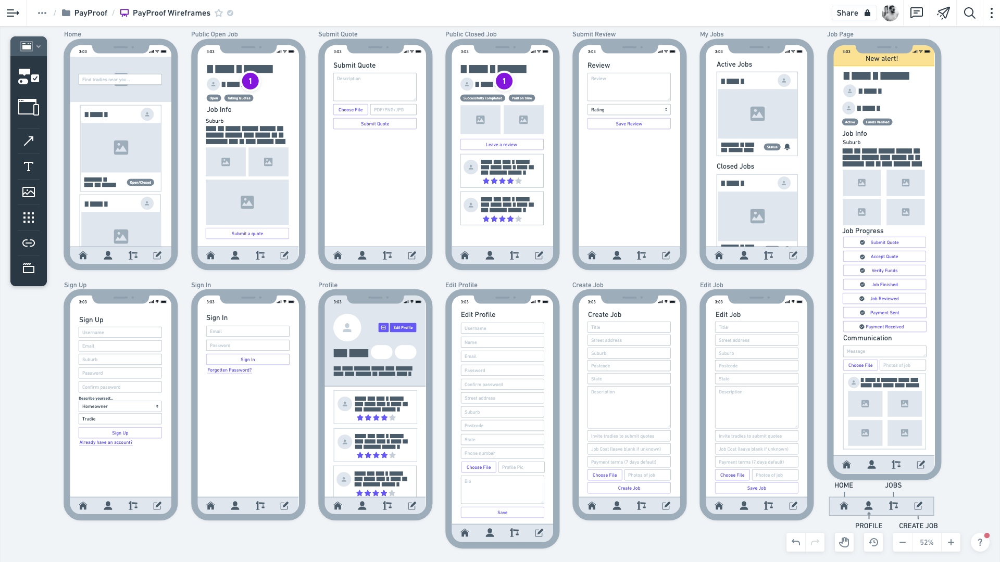
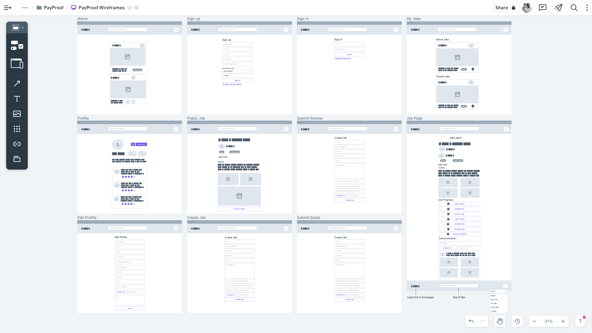

## ERD

Here is a link to the [ERD](https://whimsical.com/payproof-erd-25wggk7mCMwM3XPDkmJorC)

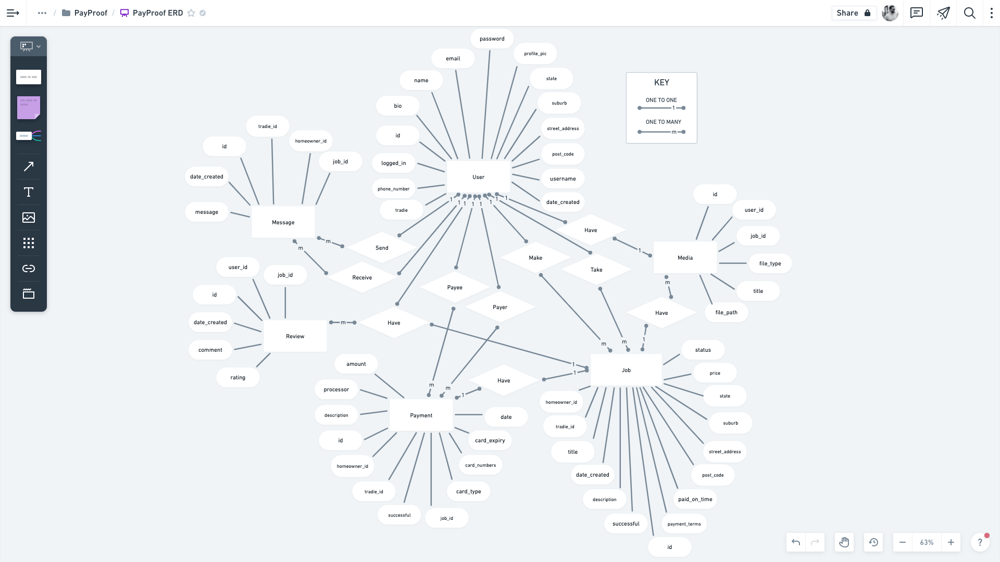

Here is a link to the [relational model diagram](https://drawsql.app/jwsandeman/diagrams/payproof)

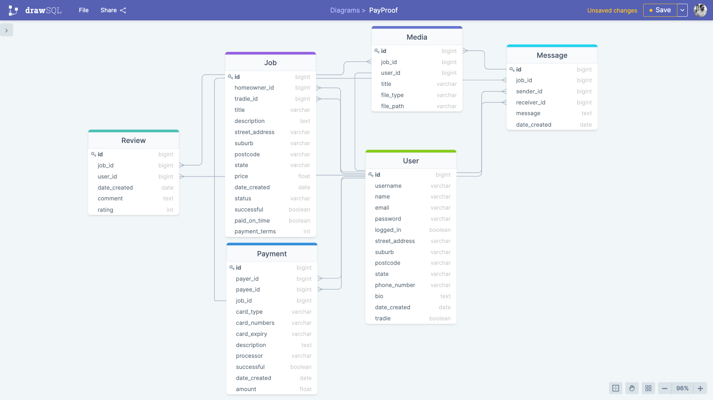

## High-Level Components

### Application Structure

The 2 sided marketplace is built using ruby on rails which utilise the Model View Controller(MVC) design which essentially splits the logic into 3 components - Controller which are the brains, Views which is everything the user sees and the Model which handles all of the database manipulations. The database being used is PostgreSQL which is a relational database that uses tables of related data to create meaningful relationships.

### Home Page

Guests in the app will be able to browse a community job board (home page) showing all of the open jobs as well as the recently completed jobs in their area. This serves two purposes, the first one is the open jobs which lets tradies who haven't signed up yet browse the open jobs to see if there are jobs that they can submit quotes for.

The second purpose is the closed jobs which let homeowners that haven't signed up yet browse recently completed jobs so that they can view a tradies quality of work and find tradies that are suited to the jobs they want to be done.

When a guest signs up as a user they can select whether they are a homeowner or a tradie and this will automatically restrict what actions they can perform in the app. This will be handled using devise, active record associations and control flow authorisation in the app.

### Job Page

A homeowner in the app can create jobs that are labelled as open which enables a tradie to submit a quote for the job which switches the job to active and associates that tradie with the job. Once the homeowner is happy with the quote they can verify their funds and the job switches to verified.

Homeowners will only be able to edit the job when its status is open, this prevents the homeowner from changing the scope once the job has begun. I plan to implement an approval process for job variations in the future but that is out of the scope of this assignment.

Once the tradie has successfully completed the work they can upload job completion photos and submit them to the homeowner for approval which switches the job status to finished. Once the homeowner is happy with the completed job they can pay the tradie, which then switches the job to sent.

Once the tradie receives the funds he can confirm the receipt of funds and this switches the job to closed. Now that the job is closed, both the homeowner and the tradie will be able to leave a public review for the job.

### Profile Page

Homeowners and tradies will be able to update their public profiles as well as display their user rating, PayProof score, recent reviews and open jobs(for homeowners) and recently successful jobs(for tradies).

## Third-Party Services

**Devise** - Devise is a Ruby gem that will handle all of the user authentication and authorisation in this app. It creates the Users table and the active record associations.

**Amazon S3** - Amazon S3 is a cloud storage service that will facilitate the storage of rich media files for this marketplace. This means that all of the photos uploaded in the application will be available on demand.

**Notion** - Project management specialising in team collaboration and customizable wiki-based documents.

**Whimsical** - Online diagramming app specialising in flow charts and wireframes.

**Github** - Used as the cloud-based source control management system for this application.

**DrawSQL** - Online drawing tool for relational database schemas.

**Simple Form** - Ruby gem used to help style form components with minimal configuration.

**Bootstrap** - Sass styling framework that integrates directly into the ruby on rails application allowing for quick and iterative design patterns.

**Heroku** - Heroku is a cloud container hosting platform that specialises in deploying ruby on rails applications from the command line.

**Rubocop** - Is a static code analyser and formatted (linter) that enforces guidelines taken from the ruby style guide.

## Models

### **User**

Users can be either homeowners or tradies which will be determined based on how they sign up. I have chosen to keep all users under the same table using a double relationship with Jobs instead of separating them into 2 separate tables of homeowners and tradies. I have done this in order to normalize the database. Users will also be able to attach profile pictures and leave reviews about their job experiences.

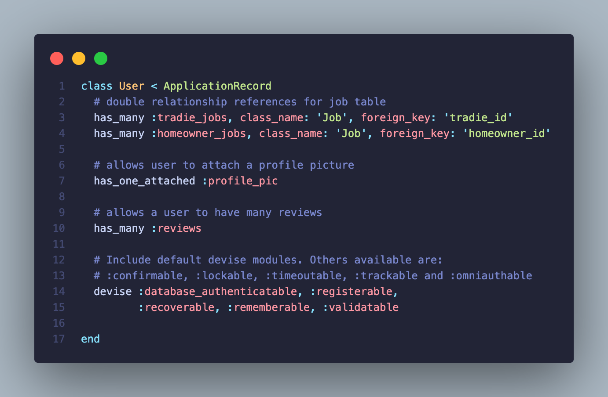

Relationships/Associations:

- Homeowner(FK - homeowner_id) can make many jobs. This allows access to all of the jobs that a homeowner has made.
- Tradie(FK - tradie_id) can take many jobs. This allows access to all of the jobs that a tradie is involved in.
- Users can have many reviews. This allows users to have many reviews on many different jobs.
- User can have one profile picture attached at a time.
- User can send many messages(future implementation)
- User can receive many messages(future implementation)
- User can have many payments(future implementation)
- Attributes - id, username, name, email, password, logged_in, street_address, suburb, postcode, state, phone_number, bio, date_created, tradie

### **Job**

The Job model will be the central model in the database which everything else revolves around. Jobs can be created by homeowners and tradies can take on these jobs once a homeowner has approved their quote. The job model will also be using a status enum which allows me to easily check/call/update the job status as the job progresses. There will be 3 different types of media files associated with the job and each job will have 2 reviews - one from the homeowner and one from the tradie.

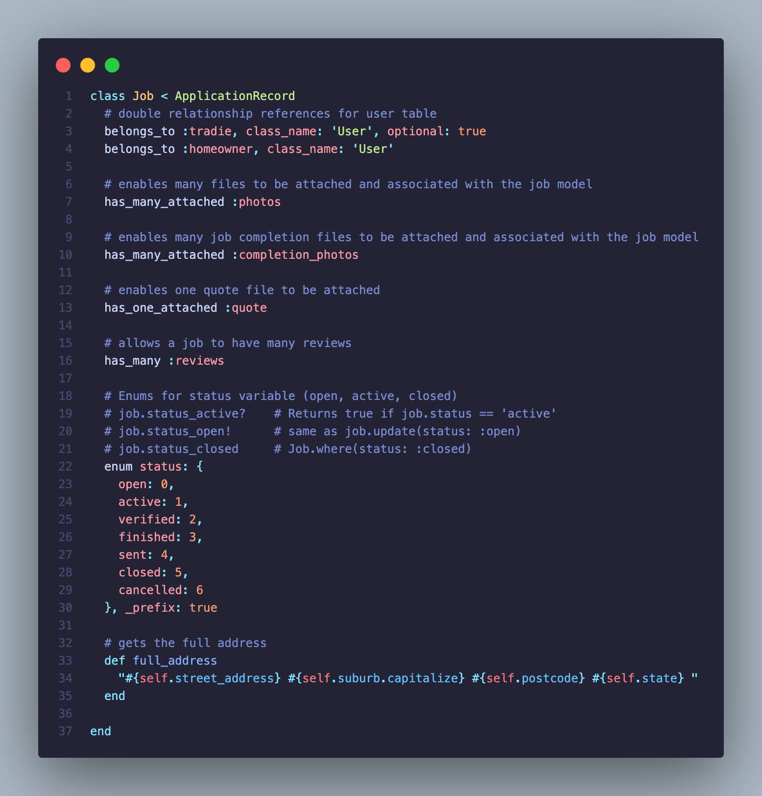

Relationships/Associations:

- Job can be made by one homeowner(FK - tradie). This allows access to the tradie of the job.
- Job can be taken by one tradie(FK - homeowner). This allows access to the homeowner of the job.
- Job can have many photos (media files). This allows the homeowner to upload many job photos when creating the job.
- Job can have many completion photos (media files). This allows the tradie to upload many completion photos to the job. I wanted these separate from the photos so that I can display the completion photos rather than the photos if the job status is closed. That way other users can see the finished product.
- Job can have one quote (media file). This allows a tradie to upload one quote photo or PDF to the job. I have kept this separate from the other 2 media files because I wanted to be able to keep quotes private on the job page except to the homeowner and tradie involved in the job.
- Job can have many reviews. This allows the job to have 2 reviews, one from the homeowner and one from the tradie.
- Job can have one payment(future implementation).
- Job can have many messages through user(future implementation).
- Attributes - id, homeowner_id, tradie_id, title, description, street_address, suburb, postcode, state, price, date_created, status, successful, paid_on_time

### **Media**

Media will contain all of the images associated with users, jobs and messages in the app. This will be handled by rails’ built-in Active Storage and Amazon’s S3 storage.

Relationships/Associations:

- Profile picture belongs to one user. This allows access to the user.
- Photos belong to one job. This allows access to the job associated with the photos.
- Completion Photos belong to one job. This allows access to the job associated with the completion photos.
- Quote belongs to one job. This allows access to the job associated with the quote.
- Attributes - id, job_id, user_id, file_type, title, file_path

### **Reviews**

Once a job has been completed, both the homeowner and the tradie can submit a review for the job. This will contain all of the info associated with the review such as rating and comments.

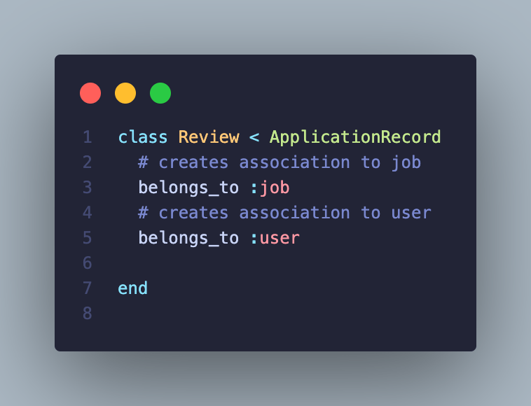

Relationships/Associations:

- Reviews belong to one job. This enables access to the job that the review is associated with.
- Reviews belong to one user. This enables access to the user who left the review.
- Attributes - id, user_id, job_id, date_created, review, rating

## Future Model Implementation

### **Payments**

Payments will contain all of the information relating to a payment made by a homeowner once a job has been successfully completed by a tradie.

Relationships/Associations:

- Payment belongs to one job. This allows access to the job that the payment is associated with.
- Payment can have one payer(FK - payer).
- Payment can have one payee(FK - payee).
- Attributes - id, homeowner_id, tradie_id, job_id, card_type, card_numbers, card_expiry, description, processor, successful, date, amount

### **Messages**

Messages will contain all of the info associated with any and all communication between a homeowner and a tradie. This communication will be accessible through jobs and through direct messaging between a homeowner and a tradie.

Relationships/Associations:

- Message can be sent by one sender(FK - sender).
- Message can be received by one receiver(FK - receiver).
- Message can have one job.
- Message can have many media files.
- Attributes - id, job_id, homeowner_id, tradie_id, message, date_created.

## Database Relations

The User table and Job table are connected to each other using foreign keys and active record associations. The User table has a double relationship with the Job table because a user can be a homeowner or a tradie which is determined when they first sign up using a select option. This allows a homeowner to make many jobs while a job can only be made by one homeowner.

The second part of the relationship is that a tradie can take many jobs but a job can only be taken by one tradie. The job table is also connected to the review, media, messages and payment tables using a foreign key. The user table is also connected to the review and media tables through a foreign key.

The message table is connected to the user table with a double relationship so that a user can be a sender or receiver of a message. The message table is also connected to the media and job tables through a foreign key.

The payments table is also connected to the user table using a double relationship so that a user can be a payee or a payer. The payments table also connects to the job table with a foreign key.

Note: Messages and payments are out of the scope of this assignment and therefore will be implemented at a later date.

## Database Schema Design

My database schema is fairly similar to my ERD with the main differences being the built-in active storage tables (attachment, blobs, and variant records) that rails creates which have different attributes to my ERD. I also do not have the payment and messaging tables as they were outside of the scope of this assignment(i ran out of time).

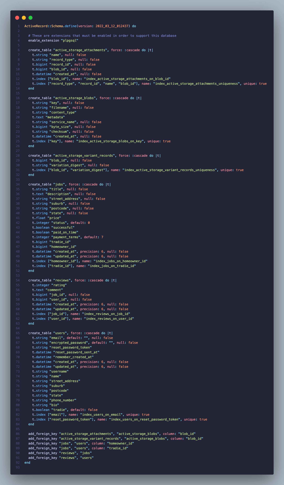

## Project Management

To help me organise this project and stick to my goals I have used a Notion project management dashboard. Here is the [link](https://jwsandeman.notion.site/T2A2-Marketplace-Project-81506ef3995f4e16bb5189c259f5baa7)  to the dashboard where you will find my "Tasks" board and my "Project Deliverables" timeline which I used to manage my time.

I used the Tasks board to keep track of any ideas, questions, bugs or general once-off tasks that came to mind.

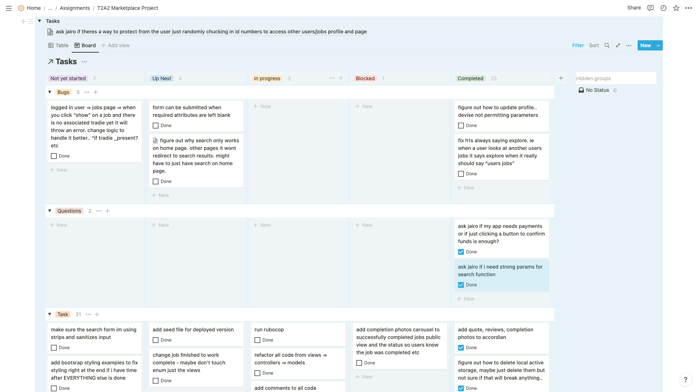
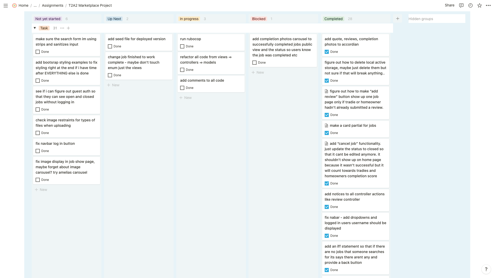

The Deliverables high-level timeline was used to manage the project implementation plan and keep me accountable.

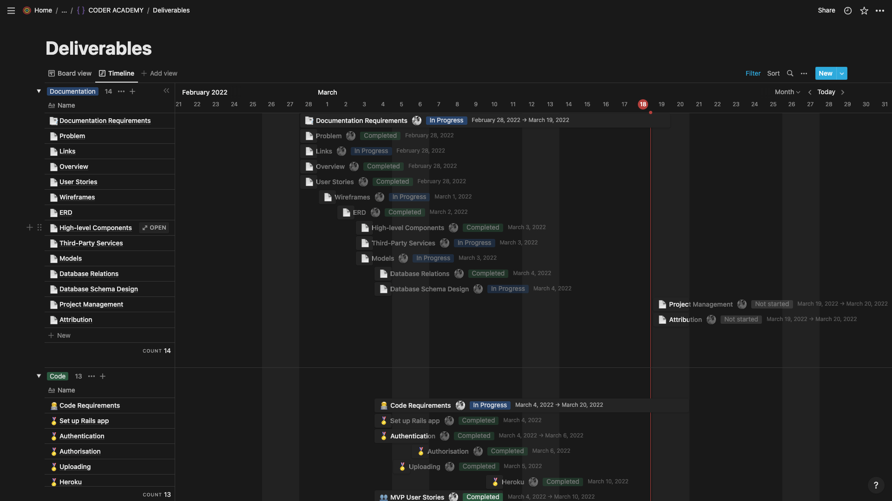
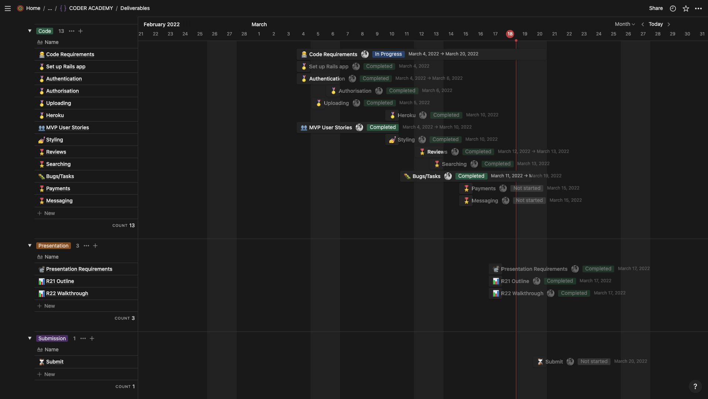

I set up the deliverables timeline by breaking each requirement of the assignment into its own card and then if needed I would then break that down even further. For example, with my user stories, I broke that down into a card in the deliverables timeline and then I broke it down further into its own kanban board for MVP user stories so that I could track each individual user story.

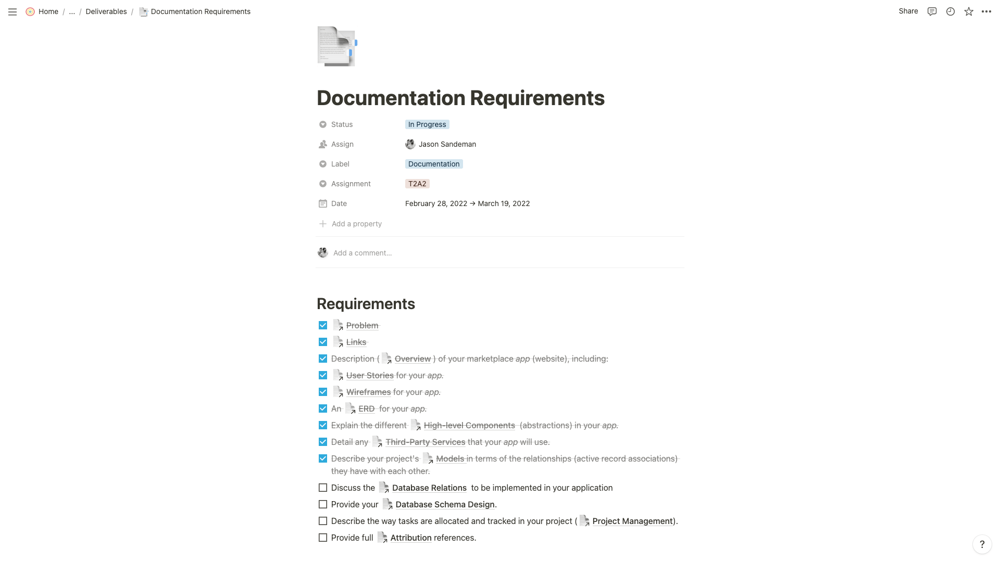
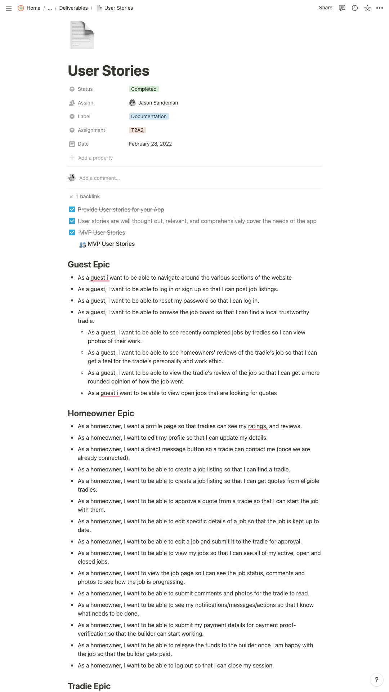
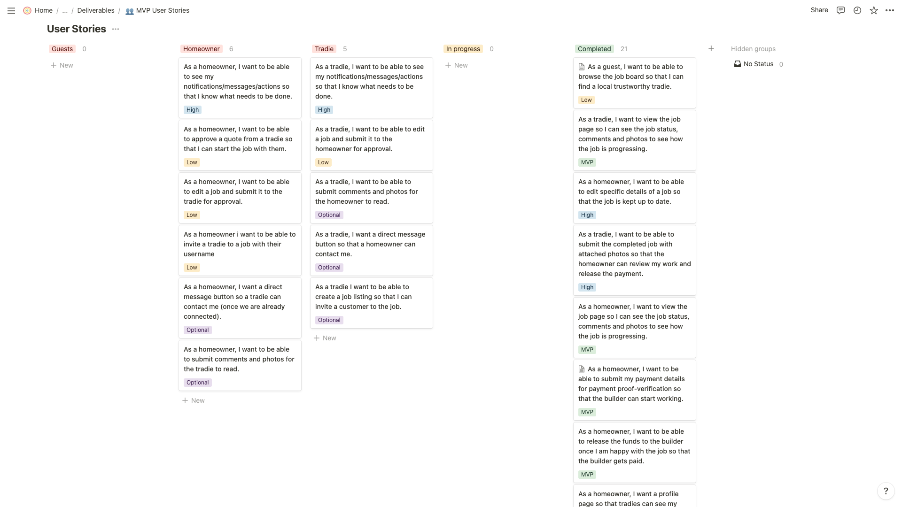
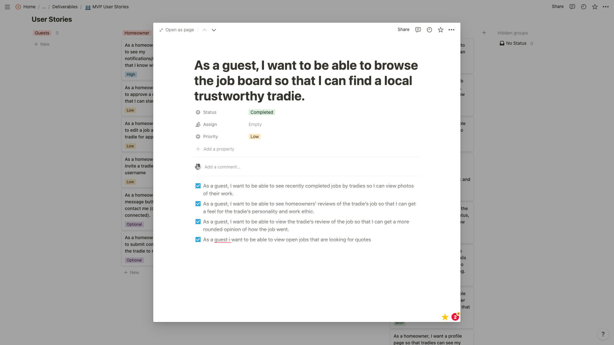

This method worked really well especially for tracking the code requirements as i was able to break each of the main requirements down into cards and then add the rubric to each individual requirement which helped me stay aligned with the assignment requirements.

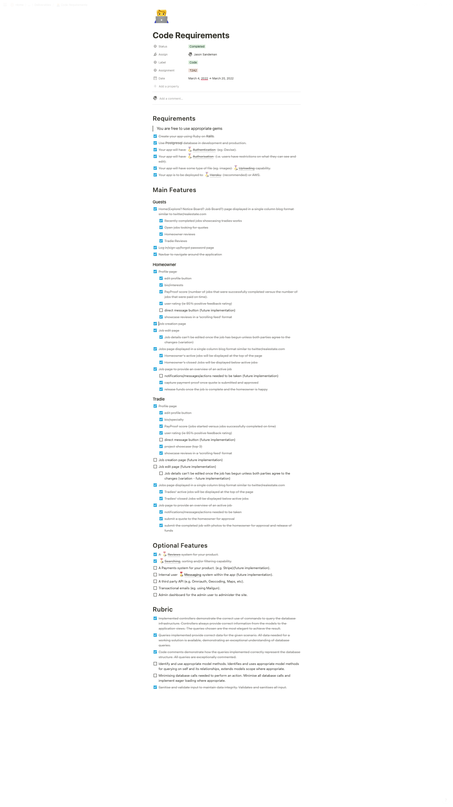
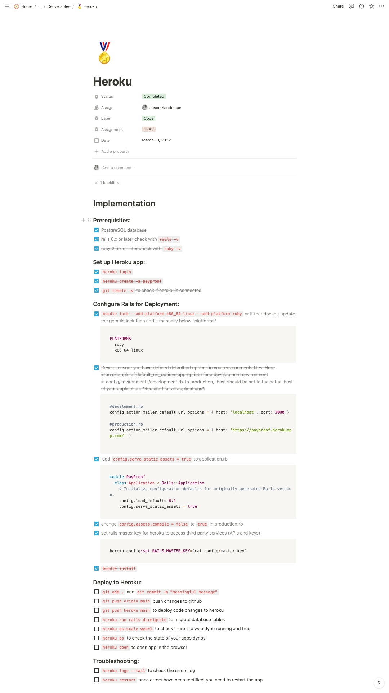

## Attribution

- gem ['bootstrap', '~> 5.1.3'](https://github.com/twbs/bootstrap-rubygem)
- gem ['jquery-rails'](https://github.com/twbs/bootstrap-rubygem)
- gem ['simple_form'](https://github.com/heartcombo/simple_form)
- gem ['devise'](https://github.com/heartcombo/devise)
- gem ['aws-sdk-s3', '~> 1'](https://github.com/aws/aws-sdk-ruby)
- gem ["rails_best_practices"](https://github.com/flyerhzm/rails_best_practices)
- gem ['dawnscanner', :require=>false](https://github.com/thesp0nge/dawnscanner)
- gem ['brakeman'](https://github.com/presidentbeef/brakeman)
- gem ['rubocop', require: false](https://github.com/rubocop/rubocop)
- Awesome Readme Templates - [https://awesomeopensource.com/project/elangosundar/awesome-README-templates](https://awesomeopensource.com/project/elangosundar/awesome-README-templates)
- Search form implementation - [https://testsuite.io/build-custom-search-in-ruby-on-rails](https://testsuite.io/build-custom-search-in-ruby-on-rails) & [https://medium.com/le-wagon/build-a-simple-search-with-the-simple-form-gem-in-rails-5-b247168282d1](https://medium.com/le-wagon/build-a-simple-search-with-the-simple-form-gem-in-rails-5-b247168282d1)
- Setting up double relationship models - [https://medium.com/le-wagon/build-a-simple-search-with-the-simple-form-gem-in-rails-5-b247168282d1](https://medium.com/le-wagon/build-a-simple-search-with-the-simple-form-gem-in-rails-5-b247168282d1)
- Using Enums in Rails - [https://betterprogramming.pub/how-to-use-enums-in-rails-6-87600e292476#:~:text=In Ruby on Rails%2C an,for enums in Rails 4.1](https://betterprogramming.pub/how-to-use-enums-in-rails-6-87600e292476#:~:text=In%20Ruby%20on%20Rails%2C%20an,for%20enums%20in%20Rails%204.1)

## Contact

To get in touch, email jw.sandeman@gmail.com or find me on [linked-in](https://www.linkedin.com/in/jason-sandeman-33268496/) or [twitter](https://twitter.com/jwsandeman).
